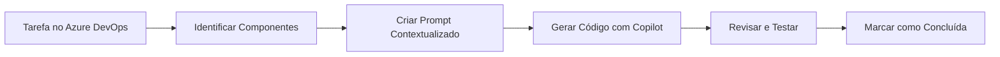

# 🚀 Roteiro de Implementação do MVP – Connexa (Etapa 3)

## 🎯 Objetivo da Atividade

Implementar as **tarefas técnicas** planejadas na Sprint (Etapa 2) para desenvolver uma versão funcional (MVP) do produto **Connexa**, utilizando o **GitHub Copilot** como assistente de desenvolvimento. Esta etapa conecta o planejamento realizado no Azure DevOps com a implementação prática do código.

---

## 📚 Pré-requisitos e Continuidade

### Contexto das Etapas Anteriores

**Etapa 1 - Requisitos:**
- ✅ User Stories definidas e priorizadas no backlog
- ✅ Critérios de aceitação estabelecidos
- ✅ Funcionalidades principais identificadas

**Etapa 2 - Tarefas e Sprint:**
- ✅ User Stories decompostas em tarefas técnicas
- ✅ Sprint planejada com tarefas atribuídas
- ✅ Definition of Done estabelecida

**Etapa 3 - Implementação (Atual):**
- 🎯 Transformar tarefas técnicas em código funcional
- 🎯 Utilizar GitHub Copilot como assistente
- 🎯 Entregar funcionalidade completa end-to-end

### Material Necessário
- Acesso ao Azure DevOps com as tarefas da Sprint
- Computador com VS Code instalado
- Node.js versão 14 ou superior instalado
- Conta GitHub com acesso ao Copilot (versão estudante gratuita disponível)

---

## 🛠️ Parte 1: Preparação do Ambiente

### 1.1. Instalação e Configuração Inicial

#### Passo 1: Verificar Pré-requisitos
```bash
# Verificar instalação do Node.js
node --version  # Deve retornar v14 ou superior

# Verificar npm
npm --version   # Deve retornar v6 ou superior
```

#### Passo 2: Estrutura do Projeto
```
connexa-mvp/
├── backend/
│   ├── src/
│   │   ├── controllers/
│   │   ├── models/
│   │   ├── routes/
│   │   └── services/
│   ├── database.js
│   └── server.js
├── frontend/
│   ├── css/
│   ├── js/
│   └── index.html
├── database/
│   └── connexa.db
└── package.json
```

### 1.2. Configuração do GitHub Copilot

#### 📋 Checklist de Configuração

1. **Instalar Extensões no VS Code:**
   - [ ] GitHub Copilot
   - [ ] GitHub Copilot Chat
   - [ ] SQLite Viewer (opcional, para visualizar o banco)

2. **Ativar o Copilot:**
   ```
   1. Abrir VS Code
   2. Pressionar Ctrl+Shift+X (Extensões)
   3. Buscar "GitHub Copilot"
   4. Instalar ambas extensões
   5. Fazer login com conta GitHub
   6. Verificar ícone do Copilot na barra inferior
   ```

3. **Testar Funcionamento:**
   - Criar arquivo `test.js`
   - Digitar: `// função para calcular média`
   - Aguardar sugestão do Copilot (texto em cinza)
   - Pressionar Tab para aceitar

---

## 🤖 Parte 2: Estratégias de Uso do GitHub Copilot

### 2.1. Modos de Interação

#### Modo 1: Autocompletar (Inline)
- **Quando usar:** Código simples e repetitivo
- **Como ativar:** Apenas comece a digitar
- **Exemplo:** Loops, validações básicas, imports

#### Modo 2: Chat (@workspace)
- **Quando usar:** Arquitetura, estrutura de projeto, código complexo
- **Como ativar:** Ctrl+Shift+I
- **Exemplo:** Criar estrutura completa de uma funcionalidade

#### Modo 3: Comandos Rápidos
- **Quando usar:** Refatoração, documentação, testes
- **Como ativar:** Selecionar código → Botão direito → Copilot
- **Exemplo:** "Explain this", "Fix this", "Generate tests"

### 2.2. Anatomia de um Prompt Eficaz

```
[CONTEXTO] + [AÇÃO ESPECÍFICA] + [DETALHES TÉCNICOS] + [FORMATO ESPERADO]
```

#### Exemplo Prático:
```
❌ Prompt Vago:
"Crie um endpoint de cadastro"

✅ Prompt Eficaz:
"Estou desenvolvendo a API REST do Connexa, um sistema de grupos de estudo universitário. 
Preciso criar um endpoint POST /api/usuarios/cadastro usando Express.js que:
1. Receba JSON com: nomeCompleto, email, curso, semestre, senha
2. Valide email institucional (domínio @universidade.edu.br)
3. Hash da senha com bcrypt
4. Salve no SQLite na tabela 'usuarios'
5. Retorne status 201 com ID do usuário criado
6. Trate erros de email duplicado com status 409"
```

---

## 📝 Parte 3: Implementação Guiada por Tarefas

### 3.1. Mapeamento Tarefa → Código

Para cada tarefa técnica definida na Sprint (Etapa 2), seguiremos este processo:



### 3.2. Exemplo Completo: Da Tarefa ao Código

#### 📋 Tarefa Original (Azure DevOps)
**ID:** TASK-005  
**Título:** Back-end: Criar endpoint POST /api/usuarios/cadastro  
**User Story Pai:** Cadastro de Usuário  
**Responsável:** João Silva  
**Estimativa:** 4 horas  

#### 🔄 Processo de Implementação

**PASSO 1: Preparar o Contexto**

Abra o Copilot Chat e forneça o contexto do projeto:

```prompt
@workspace Vou implementar a tarefa TASK-005 do nosso Sprint.

Contexto do Projeto Connexa:
- Plataforma web para grupos de estudo universitário
- Stack: Node.js + Express + SQLite + HTML/CSS/JS
- Já temos a estrutura básica do projeto criada

User Story: Como aluno universitário, quero me cadastrar usando email institucional

Critérios de Aceitação da Story:
1. Validar domínio @universidade.edu.br
2. Senha com 8+ caracteres, maiúscula, minúscula e número
3. Não permitir emails duplicados
4. Enviar email de confirmação
5. Mensagens de erro claras

Tarefa Específica: Criar endpoint POST /api/usuarios/cadastro
```

**PASSO 2: Solicitar Implementação Incremental**

```prompt
@workspace Baseado no contexto acima, implemente o endpoint de cadastro em etapas:

1. Primeiro, crie a estrutura básica do endpoint em routes/usuarios.js
2. Adicione validação dos campos obrigatórios
3. Implemente a validação do domínio do email
4. Adicione verificação de email duplicado no banco
5. Implemente hash de senha com bcrypt
6. Adicione tratamento de erros apropriado

Use as melhores práticas de segurança e organize o código de forma modular.
```

**PASSO 3: Código Gerado e Refinamento**

O Copilot gerará algo similar a:

```javascript
// routes/usuarios.js
const express = require('express');
const bcrypt = require('bcrypt');
const router = express.Router();
const { validarEmail, validarSenha } = require('../utils/validators');
const db = require('../database');

/**
 * POST /api/usuarios/cadastro
 * Tarefa: TASK-005
 * User Story: Cadastro de Usuário
 * 
 * Critérios implementados:
 * - Validação de domínio institucional
 * - Regras de complexidade de senha
 * - Prevenção de emails duplicados
 * - Hash seguro de senha
 */
router.post('/cadastro', async (req, res) => {
    const { nomeCompleto, email, curso, semestre, senha } = req.body;

    // 1. Validar campos obrigatórios
    if (!nomeCompleto || !email || !senha) {
        return res.status(400).json({ 
            erro: 'Nome completo, email e senha são obrigatórios',
            camposFaltantes: {
                nomeCompleto: !nomeCompleto,
                email: !email,
                senha: !senha
            }
        });
    }

    // 2. Validar domínio do email institucional
    const dominioValido = '@universidade.edu.br';
    if (!email.endsWith(dominioValido)) {
        return res.status(400).json({ 
            erro: `Email deve ser do domínio institucional ${dominioValido}`,
            emailInformado: email
        });
    }

    // 3. Validar complexidade da senha
    const regexSenha = /^(?=.*[a-z])(?=.*[A-Z])(?=.*\d).{8,}$/;
    if (!regexSenha.test(senha)) {
        return res.status(400).json({ 
            erro: 'Senha deve ter no mínimo 8 caracteres, incluindo maiúscula, minúscula e número',
            requisitos: {
                tamanhoMinimo: 8,
                maiuscula: true,
                minuscula: true,
                numero: true
            }
        });
    }

    try {
        // 4. Verificar se email já existe
        const usuarioExistente = await db.get(
            'SELECT id FROM usuarios WHERE email = ?',
            [email]
        );

        if (usuarioExistente) {
            return res.status(409).json({ 
                erro: 'Este email já está cadastrado no sistema'
            });
        }

        // 5. Criar hash da senha
        const saltRounds = 10;
        const senhaHash = await bcrypt.hash(senha, saltRounds);

        // 6. Inserir usuário no banco
        const resultado = await db.run(
            `INSERT INTO usuarios (nome, email, curso, semestre, senha, criado_em) 
             VALUES (?, ?, ?, ?, ?, datetime('now'))`,
            [nomeCompleto, email, curso, semestre, senhaHash]
        );

        // 7. TODO: Implementar envio de email de confirmação
        // await enviarEmailConfirmacao(email, nomeCompleto);

        res.status(201).json({ 
            mensagem: 'Usuário cadastrado com sucesso!',
            usuarioId: resultado.lastID,
            proximoPasso: 'Verifique seu email para confirmar o cadastro'
        });

    } catch (erro) {
        console.error('Erro ao cadastrar usuário:', erro);
        res.status(500).json({ 
            erro: 'Erro interno ao processar cadastro',
            suporte: 'Entre em contato com suporte@connexa.com'
        });
    }
});

module.exports = router;
```

### 3.3. Implementação do Frontend Vinculado

**PASSO 4: Criar Interface Correspondente**

```prompt
@workspace Agora preciso criar o frontend para consumir o endpoint TASK-005 que acabamos de criar.

Crie um formulário HTML/CSS/JS em frontend/cadastro.html que:
1. Tenha os campos correspondentes ao endpoint
2. Faça validação em tempo real dos campos
3. Mostre feedback visual durante o envio
4. Exiba mensagens de sucesso/erro retornadas pelo backend
5. Use design responsivo e acessível
6. Siga as cores da identidade visual: azul (#007bff) e branco

Vincule com a tarefa TASK-005 através de comentários no código.
```

---

## 🧪 Parte 4: Testes e Validação

### 4.1. Gerando Testes com Copilot

Para cada tarefa implementada, gere testes correspondentes:

```prompt
@workspace Crie testes unitários para o endpoint de cadastro (TASK-005) usando Jest.
Os testes devem cobrir:
1. Cadastro com sucesso
2. Validação de campos obrigatórios
3. Validação de domínio de email
4. Validação de senha fraca
5. Tentativa de cadastro com email duplicado
6. Erro de banco de dados

Use mocks para o banco de dados e bcrypt.
```

### 4.2. Checklist de Validação por Tarefa

Antes de marcar uma tarefa como concluída:

- [ ] Código atende todos os critérios de aceitação da User Story
- [ ] Testes unitários passando
- [ ] Código revisado por outro membro (pair programming)
- [ ] Frontend e backend integrados e funcionando
- [ ] Documentação inline adequada
- [ ] Sem erros no console ou warnings
- [ ] Tarefa atualizada no Azure DevOps

---

## 📊 Parte 5: Métricas e Acompanhamento

### 5.1. Registro de Produtividade

Para cada tarefa, registre:

| Tarefa ID | Tempo Estimado | Tempo Real | Prompts Usados | Retrabalho | Observações |
|-----------|----------------|------------|----------------|------------|-------------|
| TASK-005  | 4h            | 2.5h       | 6              | 1x         | Copilot acelerou validações |
| TASK-006  | 2h            | 1.5h       | 3              | 0x         | Reutilizou código anterior |

### 5.2. Aprendizados e Melhores Práticas

**✅ O que funciona bem:**
- Prompts com contexto detalhado e exemplos
- Implementação incremental (pequenos passos)
- Revisão imediata do código gerado
- Comentários vinculando código às tarefas

**❌ O que evitar:**
- Aceitar código sem entender
- Prompts muito genéricos
- Pular a fase de testes
- Não documentar decisões técnicas

---

## 🎯 Parte 6: Exercício Prático Progressivo

### Nível 1: Tarefa Simples (30 min)
**Objetivo:** Criar modelo de dados para grupos de estudo

```prompt
Tarefa TASK-010: Criar tabela 'grupos' no SQLite
Campos: id, nome, materia, objetivo, local, limite_participantes, criador_id, criado_em
```

### Nível 2: Tarefa Média (1h)
**Objetivo:** Implementar listagem de grupos

```prompt
Tarefa TASK-015: Criar endpoint GET /api/grupos com filtros por matéria e local
Deve retornar JSON paginado com 10 grupos por página
```

### Nível 3: Tarefa Complexa (2h)
**Objetivo:** Sistema de participação em grupos

```prompt
Tarefa TASK-020: Implementar funcionalidade completa de participação
- POST /api/grupos/:id/participar
- DELETE /api/grupos/:id/sair
- GET /api/grupos/:id/participantes
- Validar limite de participantes
- Impedir criador de sair do próprio grupo
```

---

## 🚀 Parte 7: Dicas Avançadas

### 7.1. Padrões de Prompt por Tipo de Tarefa

#### Para Criação de APIs:
```
"Crie um endpoint [MÉTODO] [ROTA] que [OBJETIVO].
Entrada: [ESTRUTURA_DADOS]
Validações: [LISTA_VALIDAÇÕES]
Resposta sucesso: [STATUS] com [DADOS]
Resposta erro: [CENÁRIOS_ERRO]
Segurança: [CONSIDERAÇÕES]"
```

#### Para Interfaces:
```
"Crie uma interface [TIPO] para [FUNCIONALIDADE].
Campos: [LISTA_CAMPOS]
Validações visuais: [FEEDBACK_TEMPO_REAL]
Integração: [ENDPOINT_BACKEND]
Acessibilidade: [REQUISITOS_A11Y]
Responsividade: [BREAKPOINTS]"
```

### 7.2. Troubleshooting Comum

| Problema | Solução |
|----------|---------|
| Copilot não sugere nada | Adicione mais contexto ou comentários |
| Código incorreto/inseguro | Seja mais específico sobre requisitos de segurança |
| Sugestões repetitivas | Use "Alternative approach:" no prompt |
| Código não funciona | Peça explicação passo a passo primeiro |

---

## ✅ Critérios de Entrega (Via Microsoft Teams)

### Entregáveis Obrigatórios:

1. **📝 Documento de Prompts (prompts.md):**
   ```markdown
   # Prompts Utilizados - Grupo X

   ## Tarefa: TASK-005 - Endpoint de Cadastro
   ### Prompt Backend:
   [Texto completo do prompt usado]
   
   ### Resultado:
   [Breve descrição do código gerado]
   
   ### Prompt Frontend:
   [Texto completo do prompt usado]
   
   ### Resultado:
   [Breve descrição da interface gerada]
   
   ## Tarefa: TASK-XXX - [Próxima tarefa]
   ...
   ```

2. **💻 Código Fonte:**
   - Repositório Git com commits organizados por tarefa
   - README.md com instruções de execução
   - Comentários vinculando código às tarefas do Azure DevOps

3. **📊 Relatório de Produtividade:**
   - Tabela comparando tempo estimado vs. real
   - Análise do impacto do Copilot na produtividade
   - Lições aprendidas e recomendações

4. **🎥 Vídeo Demonstrativo (2-3 min):**
   - Mostrar aplicação funcionando
   - Demonstrar uma integração completa (cadastro de usuário)
   - Explicar brevemente como o Copilot ajudou

### Estrutura de Entrega:
```
entrega-etapa3/
├── prompts.md
├── relatorio-produtividade.pdf
├── link-repositorio.txt
└── link-video.txt
```

---

## 📖 Referências e Recursos Complementares

### Documentação Oficial
- [GitHub Copilot Docs](https://docs.github.com/pt/copilot)
- [Copilot Best Practices](https://github.blog/2023-06-20-how-to-write-better-prompts-for-github-copilot/)
- [Express.js Guide](https://expressjs.com/pt-br/guide/routing.html)
- [SQLite com Node.js](https://www.sqlitetutorial.net/sqlite-nodejs/)

### Vídeos Tutoriais
- [GitHub Copilot in VS Code](https://www.youtube.com/watch?v=jXp5D5ZnxGM)
- [Building REST APIs with Express](https://www.youtube.com/watch?v=l8WPWK9mS5M)

### Ferramentas Auxiliares
- [Postman](https://www.postman.com/) - Testar APIs
- [DB Browser for SQLite](https://sqlitebrowser.org/) - Visualizar banco
- [Excalidraw](https://excalidraw.com/) - Diagramas rápidos


