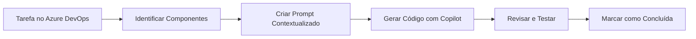

# 🚀Implementação do MVP – Connexa (Etapa 3 - Final)

## 🎯 Objetivo da Atividade

Implementar as **tarefas técnicas** planejadas na Sprint (Etapa 2) para desenvolver uma versão funcional (MVP) do produto **Connexa**, utilizando o **GitHub Copilot** como assistente de desenvolvimento. Esta etapa conecta o planejamento realizado no Azure DevOps com a implementação prática do código.

---

## 📚 Pré-requisitos e Continuidade

### Contexto das Etapas Anteriores

**[Etapa 1 – Levantamento de Requisitos](https://github.com/EngSoftwareFatecRL/03-DefinicaoRequisitos):**
- ✅ User Stories definidas e priorizadas no backlog (Azure DevOps Boards)
- ✅ Critérios de aceitação estabelecidos (mínimo 2 por story)
- ✅ Funcionalidades principais identificadas
- ✅ Análise crítica do uso de IA documentada

**[Etapa 2 – Definição de Tarefas e Planejamento de Sprint](https://github.com/EngSoftwareFatecRL/04-DefinicaoTarefas):**
- ✅ User Stories decompostas em tarefas técnicas (front-end, back-end, banco de dados)
- ✅ Sprint planejada com tarefas atribuídas (cada integrante com ao menos 2 tarefas)
- ✅ Definition of Done (DoD) estabelecida pelo time

**Etapa 3 - Implementação (Atual):**
- 🎯 Transformar tarefas técnicas em código funcional
- 🎯 Utilizar GitHub Copilot como assistente
- 🎯 Entregar funcionalidade completa end-to-end
- 🎯 Submeter o código ao repositório do grupo — **Azure Repos** (integrado ao projeto Azure DevOps) **ou GitHub** (veja [Caminho Alternativo](#-caminho-alternativo-repositório-no-github))

### Material Necessário
- Acesso ao **mesmo projeto** Azure DevOps criado na Etapa 1 (ex: `Connexa-Grupo01`) com o backlog e a Sprint configurados
- Computador com VS Code instalado
- Node.js versão 14 ou superior instalado
- Conta GitHub com acesso ao Copilot (versão estudante gratuita disponível)

---

## 🛠️ Parte 1: Preparação do Ambiente

### 1.1. Instalação e Configuração Inicial

#### Passo 1: Verificar Pré-requisitos
```bash
# Verificar instalação do Node.js
node --version  # Deve retornar v14 ou superior

# Verificar npm
npm --version   # Deve retornar v6 ou superior
```

#### Passo 2: Estrutura do Projeto
```
connexa-mvp/
├── backend/
│   ├── src/
│   │   ├── controllers/
│   │   ├── models/
│   │   ├── routes/
│   │   └── services/
│   ├── database.js
│   └── server.js
├── frontend/
│   ├── css/
│   ├── js/
│   └── index.html
├── database/
│   └── connexa.db
└── package.json
```

### 1.2. Configuração do GitHub Copilot

#### 📋 Checklist de Configuração

1. **Instalar Extensões no VS Code:**
   - [ ] GitHub Copilot
   - [ ] GitHub Copilot Chat
   - [ ] SQLite Viewer (opcional, para visualizar o banco)

2. **Ativar o Copilot:**
   ```
   1. Abrir VS Code
   2. Pressionar Ctrl+Shift+X (Extensões)
   3. Buscar "GitHub Copilot"
   4. Instalar ambas extensões
   5. Fazer login com conta GitHub
   6. Verificar ícone do Copilot na barra inferior
   ```

3. **Testar Funcionamento:**
   - Criar arquivo `test.js`
   - Digitar: `// função para calcular média`
   - Aguardar sugestão do Copilot (texto em cinza)
   - Pressionar Tab para aceitar

---

### 1.3. Configuração do Repositório de Código

O código implementado nesta etapa precisa ser versionado em um repositório Git. O grupo deve escolher **uma** das duas opções abaixo e usá-la de forma consistente.

---

#### 🔵 Opção A: Azure Repos (integrado ao projeto Azure DevOps)

Esta é a opção que mantém tudo dentro do mesmo ecossistema Azure DevOps já usado nas Etapas 1 e 2, permitindo vincular commits diretamente a work items (tasks) do Azure Boards.

**Passo a passo:**

1. Acesse seu projeto no Azure DevOps (ex: `Connexa-Grupo01`)
2. No menu lateral, clique em **Repos** → **Files**
3. Se o repositório estiver vazio, siga as instruções de inicialização exibidas na tela:
   ```bash
   git init
   git remote add origin https://dev.azure.com/SUA_ORG/Connexa-Grupo01/_git/Connexa-Grupo01
   git add .
   git commit -m "feat: estrutura inicial do projeto Connexa"
   git push -u origin main
   ```
4. Instale a extensão **[Azure Repos](https://marketplace.visualstudio.com/items?itemName=ms-vsts.team)** no VS Code para acesso direto pelo editor.

**Vincular um commit a uma task do Azure Boards:**
```bash
# Inclua o ID da task no Azure DevOps na mensagem do commit
git commit -m "feat: criar endpoint POST /api/usuarios/cadastro #47"
```
O `#47` (ID real da sua task) cria um link automático entre o commit e o work item no Azure Boards.

---

#### 🟢 Opção B: GitHub (alternativa ao Azure Repos) <a name="-caminho-alternativo-repositório-no-github"></a>

Esta opção usa o GitHub como repositório de código. O grupo continua usando o **Azure DevOps Boards** para gerenciar as tasks e a Sprint — apenas o repositório de código muda para o GitHub.

> ✅ **Quando preferir esta opção:** o grupo já tem familiaridade com GitHub, deseja integrar facilmente com as opções de deploy (Render, Railway, GitHub Pages) ou pretende usar o GitHub Actions para CI.

**Passo a passo:**

1. Um integrante cria um **repositório privado** no GitHub:
   - Acesse [https://github.com/new](https://github.com/new)
   - Nome sugerido: `connexa-mvp` ou `connexa-grupo01`
   - Visibilidade: **Private**
   - Clique em **Create repository**

2. Clone e configure o repositório localmente:
   ```bash
   git init
   git remote add origin https://github.com/SEU_USUARIO/connexa-mvp.git
   git add .
   git commit -m "feat: estrutura inicial do projeto Connexa"
   git push -u origin main
   ```

3. Convide os demais integrantes do grupo:
   - No repositório → **Settings** → **Collaborators** → **Add people**

4. **Vincular commits às tasks do Azure DevOps (opcional mas recomendado):**
   Inclua o ID da task do Azure Boards na mensagem do commit para manter a rastreabilidade:
   ```bash
   # Formato: AB#ID_DA_TASK
   git commit -m "feat: criar endpoint POST /api/usuarios/cadastro AB#47"
   ```
   Para ativar a integração automática entre GitHub e Azure Boards, configure o **GitHub App do Azure Boards**:
   - No Azure DevOps → **Project Settings** → **GitHub connections** → **Connect your GitHub account**
   - Após conectar, referências `AB#47` nos commits e PRs aparecem automaticamente no work item.

5. **Boas práticas de branch:**
   ```bash
   # Crie uma branch para cada task antes de começar a implementar
   git checkout -b feature/cadastro-usuario

   # Após concluir, abra um Pull Request para a branch main
   # O Code Review do DoD pode ser feito diretamente no PR do GitHub
   ```

**📋 Checklist da Opção B:**
- [ ] Repositório criado como **privado** no GitHub
- [ ] Todos os integrantes adicionados como colaboradores
- [ ] `.gitignore` configurado (Node.js) — inclui `node_modules/`, `.env`, `database/*.db`
- [ ] Mensagens de commit referenciam os IDs das tasks do Azure Boards (`AB#ID`)
- [ ] Azure Boards conectado ao repositório GitHub (opcional, para rastreabilidade automática)

---

> 💡 **Independente da opção escolhida**, configure o `.gitignore` antes do primeiro commit:
> ```bash
> # Peça ao Copilot para gerar o arquivo
> # Prompt: "Gere um .gitignore para projeto Node.js com SQLite"
> ```

---

## 🤖 Parte 2: Estratégias de Uso do GitHub Copilot

### 2.1. Modos de Interação

#### Modo 1: Autocompletar (Inline)
- **Quando usar:** Código simples e repetitivo
- **Como ativar:** Apenas comece a digitar
- **Exemplo:** Loops, validações básicas, imports

#### Modo 2: Chat (@workspace)
- **Quando usar:** Arquitetura, estrutura de projeto, código complexo
- **Como ativar:** Ctrl+Shift+I
- **Exemplo:** Criar estrutura completa de uma funcionalidade

#### Modo 3: Comandos Rápidos
- **Quando usar:** Refatoração, documentação, testes
- **Como ativar:** Selecionar código → Botão direito → Copilot
- **Exemplo:** "Explain this", "Fix this", "Generate tests"

### 2.2. Anatomia de um Prompt Eficaz

```
[CONTEXTO] + [AÇÃO ESPECÍFICA] + [DETALHES TÉCNICOS] + [FORMATO ESPERADO]
```

#### Exemplo Prático:
```
❌ Prompt Vago:
"Crie um endpoint de cadastro"

✅ Prompt Eficaz:
"Estou desenvolvendo a API REST do Connexa, um sistema de grupos de estudo universitário. 
Preciso criar um endpoint POST /api/usuarios/cadastro usando Express.js que:
1. Receba JSON com: nomeCompleto, email, curso, semestre, senha
2. Valide email institucional (domínio @universidade.edu.br)
3. Hash da senha com bcrypt
4. Salve no SQLite na tabela 'usuarios'
5. Retorne status 201 com ID do usuário criado
6. Trate erros de email duplicado com status 409"
```

---

## 📝 Parte 3: Implementação Guiada por Tarefas

### 3.1. Mapeamento Tarefa → Código

Para cada tarefa técnica definida na Sprint (Etapa 2), seguiremos este processo:



### 3.2. Exemplo Completo: Da Tarefa ao Código

> **Nota sobre IDs de tarefas:** No Azure DevOps, os IDs são números gerados automaticamente pelo sistema (ex: `#47`). As referências como "TASK-005" abaixo são meramente ilustrativas — use o ID real do seu work item no Azure Boards.

#### 📋 Tarefa Original (Azure DevOps)
**ID:** TASK-005 *(exemplo ilustrativo — utilize o ID real gerado pelo Azure DevOps)*  
**Título:** Back-end: Criar endpoint POST /api/usuarios/cadastro  
**User Story Pai:** Cadastro de Usuário  
**Responsável:** João Silva  
**Estimativa:** 4 horas  

#### 🔄 Processo de Implementação

**PASSO 1: Preparar o Contexto**

Abra o Copilot Chat e forneça o contexto do projeto:

```prompt
@workspace Vou implementar a tarefa TASK-005 do nosso Sprint.

Contexto do Projeto Connexa:
- Plataforma web para grupos de estudo universitário
- Stack: Node.js + Express + SQLite + HTML/CSS/JS
- Já temos a estrutura básica do projeto criada

User Story: Como aluno universitário, quero me cadastrar usando email institucional

Critérios de Aceitação da Story:
1. Validar domínio @universidade.edu.br
2. Senha com 8+ caracteres, maiúscula, minúscula e número
3. Não permitir emails duplicados
4. Enviar email de confirmação
5. Mensagens de erro claras

Tarefa Específica: Criar endpoint POST /api/usuarios/cadastro
```

**PASSO 2: Solicitar Implementação Incremental**

```prompt
@workspace Baseado no contexto acima, implemente o endpoint de cadastro em etapas:

1. Primeiro, crie a estrutura básica do endpoint em routes/usuarios.js
2. Adicione validação dos campos obrigatórios
3. Implemente a validação do domínio do email
4. Adicione verificação de email duplicado no banco
5. Implemente hash de senha com bcrypt
6. Adicione tratamento de erros apropriado

Use as melhores práticas de segurança e organize o código de forma modular.
```

**PASSO 3: Código Gerado e Refinamento**

O Copilot gerará algo similar a:

```javascript
// routes/usuarios.js
const express = require('express');
const bcrypt = require('bcrypt');
const router = express.Router();
const { validarEmail, validarSenha } = require('../utils/validators');
const db = require('../database');

/**
 * POST /api/usuarios/cadastro
 * Tarefa: TASK-005
 * User Story: Cadastro de Usuário
 * 
 * Critérios implementados:
 * - Validação de domínio institucional
 * - Regras de complexidade de senha
 * - Prevenção de emails duplicados
 * - Hash seguro de senha
 */
router.post('/cadastro', async (req, res) => {
    const { nomeCompleto, email, curso, semestre, senha } = req.body;

    // 1. Validar campos obrigatórios
    if (!nomeCompleto || !email || !senha) {
        return res.status(400).json({ 
            erro: 'Nome completo, email e senha são obrigatórios',
            camposFaltantes: {
                nomeCompleto: !nomeCompleto,
                email: !email,
                senha: !senha
            }
        });
    }

    // 2. Validar domínio do email institucional
    const dominioValido = '@universidade.edu.br';
    if (!email.endsWith(dominioValido)) {
        return res.status(400).json({ 
            erro: `Email deve ser do domínio institucional ${dominioValido}`,
            emailInformado: email
        });
    }

    // 3. Validar complexidade da senha
    const regexSenha = /^(?=.*[a-z])(?=.*[A-Z])(?=.*\d).{8,}$/;
    if (!regexSenha.test(senha)) {
        return res.status(400).json({ 
            erro: 'Senha deve ter no mínimo 8 caracteres, incluindo maiúscula, minúscula e número',
            requisitos: {
                tamanhoMinimo: 8,
                maiuscula: true,
                minuscula: true,
                numero: true
            }
        });
    }

    try {
        // 4. Verificar se email já existe
        const usuarioExistente = await db.get(
            'SELECT id FROM usuarios WHERE email = ?',
            [email]
        );

        if (usuarioExistente) {
            return res.status(409).json({ 
                erro: 'Este email já está cadastrado no sistema'
            });
        }

        // 5. Criar hash da senha
        const saltRounds = 10;
        const senhaHash = await bcrypt.hash(senha, saltRounds);

        // 6. Inserir usuário no banco
        const resultado = await db.run(
            `INSERT INTO usuarios (nome, email, curso, semestre, senha, criado_em) 
             VALUES (?, ?, ?, ?, ?, datetime('now'))`,
            [nomeCompleto, email, curso, semestre, senhaHash]
        );

        // 7. TODO: Implementar envio de email de confirmação
        // await enviarEmailConfirmacao(email, nomeCompleto);

        res.status(201).json({ 
            mensagem: 'Usuário cadastrado com sucesso!',
            usuarioId: resultado.lastID,
            proximoPasso: 'Verifique seu email para confirmar o cadastro'
        });

    } catch (erro) {
        console.error('Erro ao cadastrar usuário:', erro);
        res.status(500).json({ 
            erro: 'Erro interno ao processar cadastro',
            suporte: 'Entre em contato com suporte@connexa.com'
        });
    }
});

module.exports = router;
```

### 3.3. Implementação do Frontend Vinculado

**PASSO 4: Criar Interface Correspondente**

```prompt
@workspace Agora preciso criar o frontend para consumir o endpoint TASK-005 que acabamos de criar.

Crie um formulário HTML/CSS/JS em frontend/cadastro.html que:
1. Tenha os campos correspondentes ao endpoint
2. Faça validação em tempo real dos campos
3. Mostre feedback visual durante o envio
4. Exiba mensagens de sucesso/erro retornadas pelo backend
5. Use design responsivo e acessível
6. Siga as cores da identidade visual: azul (#007bff) e branco

Vincule com a tarefa TASK-005 através de comentários no código.
```

---

## 🧪 Parte 4:  Validação

### 4.1. Checklist de Validação por Tarefa (Definition of Done)

Este checklist deve refletir o **Definition of Done** que o seu time estabeleceu na Etapa 2. A lista abaixo é um modelo de referência — ajuste conforme o DoD do seu grupo:

- [ ] Código atende todos os critérios de aceitação da User Story
- [ ] (Sugerido) Testes unitários criados e passando para tarefas de back-end e regras de negócio
- [ ] **Code review** realizado por pelo menos um outro membro do time antes da integração
- [ ] Frontend e backend integrados e funcionando
- [ ] Código submetido ao repositório do grupo — **Azure Repos** (Opção A) ou **GitHub** (Opção B) — com mensagem de commit referenciando a task
- [ ] Documentação inline adequada
- [ ] Sem erros no console ou warnings críticos
- [ ] Não foram introduzidos débitos técnicos conhecidos
- [ ] Tarefa atualizada no Azure DevOps (movida para **Closed/Done** no quadro Kanban da Sprint)

---

## 📊 Parte 5: Métricas e Acompanhamento

### 5.1. Registro de Produtividade

Para cada tarefa, registre:

| Tarefa ID | Tempo Estimado | Tempo Real | Prompts Usados | Retrabalho | Observações |
|-----------|----------------|------------|----------------|------------|-------------|
| TASK-005  | 4h            | 2.5h       | 6              | 1x         | Copilot acelerou validações |
| TASK-006  | 2h            | 1.5h       | 3              | 0x         | Reutilizou código anterior |

### 5.2. Aprendizados e Melhores Práticas

**✅ O que funciona bem:**
- Prompts com contexto detalhado e exemplos
- Implementação incremental (pequenos passos)
- Revisão imediata do código gerado
- Comentários vinculando código às tarefas

**❌ O que evitar:**
- Aceitar código sem entender
- Prompts muito genéricos
- Pular a fase de testes
- Não documentar decisões técnicas

---

## 🎯 Parte 6: Exercício Prático Progressivo

> ⚠️ **Atenção:** Use as User Stories e tarefas do **seu backlog no Azure DevOps** (criado nas Etapas 1 e 2). Os exemplos abaixo são meramente ilustrativos e baseados no cenário Connexa. Substitua pelos IDs e descrições reais das suas tarefas.

### Nível 1: Tarefa Simples (30 min)
**Objetivo:** Criar modelo de dados para grupos de estudo

```prompt
[Substitua pelo ID real do Azure DevOps] Criar tabela 'grupos' no SQLite
Campos: id, nome, materia, objetivo, local, limite_participantes, criador_id, criado_em
```

### Nível 2: Tarefa Média (1h)
**Objetivo:** Implementar listagem de grupos

```prompt
[Substitua pelo ID real do Azure DevOps] Criar endpoint GET /api/grupos com filtros por matéria e local
Deve retornar JSON paginado com 10 grupos por página
```

### Nível 3: Tarefa Complexa (2h)
**Objetivo:** Sistema de participação em grupos

```prompt
[Substitua pelo ID real do Azure DevOps] Implementar funcionalidade completa de participação
- POST /api/grupos/:id/participar
- DELETE /api/grupos/:id/sair
- GET /api/grupos/:id/participantes
- Validar limite de participantes
- Impedir criador de sair do próprio grupo
```

---

## 🚀 Parte 7: Dicas Avançadas

### 7.1. Padrões de Prompt por Tipo de Tarefa

#### Para Criação de APIs:
```
"Crie um endpoint [MÉTODO] [ROTA] que [OBJETIVO].
Entrada: [ESTRUTURA_DADOS]
Validações: [LISTA_VALIDAÇÕES]
Resposta sucesso: [STATUS] com [DADOS]
Resposta erro: [CENÁRIOS_ERRO]
Segurança: [CONSIDERAÇÕES]"
```

#### Para Interfaces:
```
"Crie uma interface [TIPO] para [FUNCIONALIDADE].
Campos: [LISTA_CAMPOS]
Validações visuais: [FEEDBACK_TEMPO_REAL]
Integração: [ENDPOINT_BACKEND]
Acessibilidade: [REQUISITOS_A11Y]
Responsividade: [BREAKPOINTS]"
```

### 7.2. Troubleshooting Comum

| Problema | Solução |
|----------|---------|
| Copilot não sugere nada | Adicione mais contexto ou comentários |
| Código incorreto/inseguro | Seja mais específico sobre requisitos de segurança |
| Sugestões repetitivas | Use "Alternative approach:" no prompt |
| Código não funciona | Peça explicação passo a passo primeiro |

---

## ☁️ Parte 8: Hospedagem Gratuita do MVP

Após implementar e testar o projeto localmente, o grupo pode publicá-lo online para demonstração. Esta seção apresenta opções gratuitas de hospedagem compatíveis com a stack Node.js + SQLite do Connexa.

> **Nota:** Para fins de avaliação, a execução local é suficiente. A publicação online é **opcional**, mas fortemente recomendada para demonstrar o projeto de forma mais profissional.

---

### 🔵 Opção 1: Microsoft Azure (Recomendada — Créditos para Estudantes)

Alunos têm acesso ao **Azure for Students**, que oferece **USD 100 em créditos gratuitos por ano, sem necessidade de cartão de crédito**.

#### Pré-requisito: Ativar o Azure for Students
1. Acesse [https://azure.microsoft.com/pt-br/free/students](https://azure.microsoft.com/pt-br/free/students)
2. Clique em **"Começar gratuitamente"**
3. Faça login com seu **e-mail institucional** (o mesmo usado no Azure DevOps)
4. Siga o processo de verificação estudantil (não requer cartão de crédito)

#### Serviço recomendado: Azure App Service (Free Tier F1)

O **Azure App Service** hospeda aplicações Node.js diretamente do **Azure Repos** (integração nativa com o projeto Azure DevOps) ou do **GitHub** (caso o grupo tenha optado pelo caminho alternativo).

**Passos para publicar via VS Code:**

1. **Instale a extensão** [Azure App Service](https://marketplace.visualstudio.com/items?itemName=ms-azuretools.vscode-azureappservice) no VS Code

2. **Crie o App Service** pelo Copilot Chat:
   ```prompt
   @workspace Me ajude a criar um arquivo de configuração para publicar
   este projeto Node.js no Azure App Service. O projeto usa Express na
   porta 3000 e SQLite. Preciso do arquivo web.config e do comando
   de start correto para o Azure.
   ```

3. **Configure o `package.json`** para garantir o script de start:
   ```json
   "scripts": {
     "start": "node backend/server.js"
   }
   ```

4. **Publique via VS Code:**
   - Na barra lateral, clique no ícone do Azure
   - Em **App Service**, clique em **"+"** para criar um novo app
   - Selecione a sua assinatura de estudante
   - Escolha o plano **Free (F1)**
   - Clique com o botão direito no app criado → **"Deploy to Web App"**

5. **Acesse** a URL gerada (ex: `https://connexa-grupo01.azurewebsites.net`)

> ⚠️ **Limitação do plano F1:** O plano gratuito "adormece" após 20 minutos de inatividade. Para demonstrações, acesse a URL alguns minutos antes. Considere o plano **B1** (cobrado dos créditos estudantis) para uso mais estável.

#### Alternativa Azure: Static Web Apps (apenas para frontend)

Se o grupo quiser publicar apenas o frontend (HTML/CSS/JS):
1. Acesse [https://portal.azure.com](https://portal.azure.com)
2. Crie um recurso **Static Web Apps** (plano Free, sem custo de créditos)
3. Conecte ao repositório no Azure Repos ou GitHub

---

### 🟢 Opção 2: Render (Gratuito, sem cartão de crédito)

O [Render](https://render.com) oferece hospedagem gratuita para aplicações Node.js com deploy automático via GitHub.

**Limitação:** O serviço gratuito "adormece" após 15 minutos de inatividade e pode demorar ~30s para "acordar".

**Passos:**

1. Crie uma conta em [https://render.com](https://render.com) com sua conta GitHub
2. Clique em **"New +"** → **"Web Service"**
3. Conecte ao repositório do projeto no GitHub
4. Configure:
   - **Build Command:** `npm install`
   - **Start Command:** `node backend/server.js`
   - **Plan:** Free
5. Clique em **"Create Web Service"** e aguarde o deploy

> 📌 **Dica:** Para usar com SQLite no Render, o banco de dados precisa estar no próprio repositório ou usar um banco em memória para demonstrações. Para persistência real, veja a Opção 4 (Railway) ou migre para PostgreSQL.

---

### 🟣 Opção 3: Glitch (Gratuito, sem cartão de crédito — ideal para demos rápidas)

O [Glitch](https://glitch.com) é a opção mais simples para demonstrações rápidas. Permite editar e publicar projetos Node.js diretamente no navegador.

**Limitação:** Projetos ficam públicos no plano gratuito; "adormece" após 5 minutos.

**Passos:**

1. Acesse [https://glitch.com](https://glitch.com) e crie uma conta gratuita (sem cartão)
2. Clique em **"New Project"** → **"Import from GitHub"**
3. Cole a URL do repositório do projeto
4. Ajuste o arquivo `package.json` se necessário
5. O projeto ficará disponível em `https://nome-do-projeto.glitch.me`

---

### 🟡 Opção 4: Railway (Gratuito com limite mensal, sem cartão de crédito)

O [Railway](https://railway.app) oferece USD 5 de crédito gratuito por mês (sem cartão), suportando Node.js e bancos de dados como PostgreSQL.

**Passos:**

1. Acesse [https://railway.app](https://railway.app) e faça login com GitHub
2. Clique em **"New Project"** → **"Deploy from GitHub Repo"**
3. Selecione o repositório do projeto
4. Configure as variáveis de ambiente necessárias
5. O Railway detecta automaticamente projetos Node.js e faz o deploy

> 💡 **Dica:** Se quiser migrar do SQLite para um banco mais robusto, o Railway oferece **PostgreSQL gratuito** integrado ao mesmo projeto. Peça ajuda ao Copilot para migrar:
> ```prompt
> @workspace Me ajude a migrar o banco de dados do projeto de SQLite
> para PostgreSQL, usando a biblioteca 'pg'. Mantenha a mesma estrutura
> de tabelas e adapte as queries existentes.
> ```

---

### 📊 Comparativo das Opções

| Plataforma | Requer cartão? | Adormece? | Banco de dados | Melhor para |
|---|---|---|---|---|
| **Azure App Service** | ❌ (crédito estudante) | Sim (F1) | SQLite / externo | Integração com Azure DevOps |
| **Render** | ❌ | Sim (15 min) | SQLite (limitado) | Deploy via GitHub |
| **Glitch** | ❌ | Sim (5 min) | SQLite | Demos rápidas |
| **Railway** | ❌ | Não | SQLite / PostgreSQL | Projeto mais completo |

---

### 🤖 Usando o Copilot para Preparar o Deploy

Independente da plataforma escolhida, use o Copilot para gerar os arquivos de configuração necessários:

```prompt
@workspace Preciso preparar este projeto Node.js + Express + SQLite para deploy
na plataforma [NOME DA PLATAFORMA ESCOLHIDA]. 

Gere os arquivos de configuração necessários e aponte qualquer ajuste que
precisa ser feito no código atual (ex: porta dinâmica via variável de ambiente,
caminhos de arquivo, variáveis de configuração).
```

> ⚠️ **Importante:** Antes de publicar, garanta que dados sensíveis (senhas, chaves de API) **não estejam no código-fonte**. Use variáveis de ambiente (`.env`) e inclua o arquivo `.env` no `.gitignore`.

---

## ✅ Critérios de Entrega (Via Microsoft Teams)

### Entregáveis Obrigatórios:

### URL do Projeto no Azure DevOps:
- Deve ser o **mesmo projeto** utilizado nas Etapas 1 e 2 (ex: `Connexa-Grupo01`), com o backlog e a Sprint planejada visíveis. Certifique-se de que os instrutores continuam com acesso à organização.

### Captura de tela (screenshot) do quadro Kanban da Sprint:
- Deve exibir as tarefas implementadas nesta etapa movidas para a coluna **Done/Closed**.

### Arquivo texto contendo prompts: 
- Um arquivo texto (PDF ou Markdown) contendo o prompt utilizado para implementar pelo menos **duas tarefas**: uma de front-end e uma de back-end. Para cada prompt, informe: a tarefa do Azure DevOps correspondente e o prompt exato enviado ao Copilot.

### Print do seu projeto executando: 
- Um print (ou vídeo curto) do projeto executando a funcionalidade implementada (ex: fluxo de cadastro de usuário funcionando de ponta a ponta).

## 📖 Referências e Recursos Complementares

### Documentação Oficial
- [GitHub Copilot Docs](https://docs.github.com/pt/copilot)
- [Copilot Best Practices](https://github.blog/2023-06-20-how-to-write-better-prompts-for-github-copilot/)
- [Express.js Guide](https://expressjs.com/pt-br/guide/routing.html)
- [SQLite com Node.js](https://www.sqlitetutorial.net/sqlite-nodejs/)

### Vídeos Tutoriais
- [GitHub Copilot in VS Code](https://www.youtube.com/watch?v=jXp5D5ZnxGM)
- [Building REST APIs with Express](https://www.youtube.com/watch?v=l8WPWK9mS5M)

### Ferramentas Auxiliares
- [Postman](https://www.postman.com/) - Testar APIs
- [DB Browser for SQLite](https://sqlitebrowser.org/) - Visualizar banco
- [Excalidraw](https://excalidraw.com/) - Diagramas rápidos


